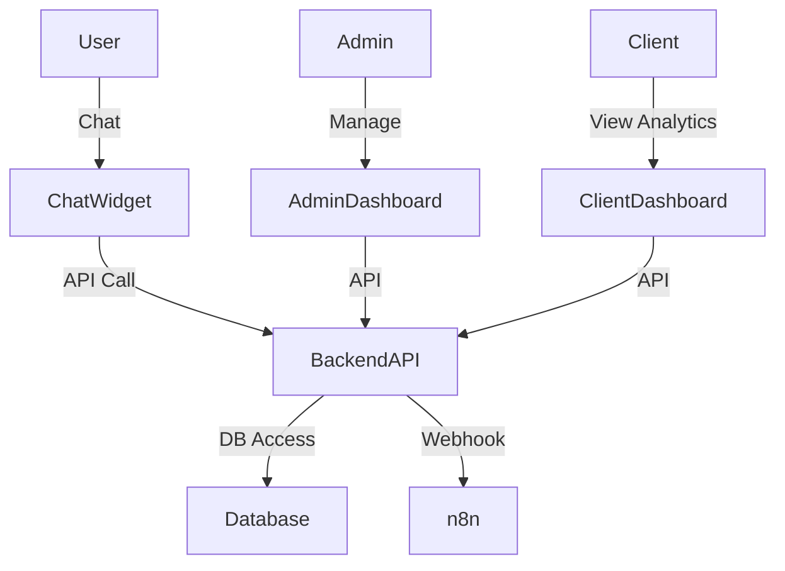

# Architecture

## Overview
This document details the architecture of the Customizable Multi-Client Chat Widget Platform. It describes each component, their responsibilities, and how they interact.

---

## Components

### 1. Admin Dashboard
- **Framework:** React (deployed via Cloudflare Pages)
- **Responsibilities:**
  - Manage clients and widgets
  - Configure widget settings and branding
  - Input and test n8n webhook URLs
  - View analytics and webhook health/errors
  - Receive alerts for webhook failures
- **Interaction:** Communicates with the backend API for all data operations and analytics.

### 2. Client Dashboard
- **Framework:** React (already built)
- **Responsibilities:**
  - Display analytics for each client's widgets (read-only)
- **Interaction:** Fetches analytics data from the backend API, scoped to the client's widgets.

### 3. Chat Widget
- **Framework:** React/Web Component (embeddable)
- **Responsibilities:**
  - Provide chat interface for end-users
  - Communicate with backend API for chat processing
  - Display responses and collect feedback
- **Interaction:** Uses widget ID and secret to securely communicate with backend API.

### 4. Backend API
- **Framework:** TypeScript (Cloudflare Pages Functions)
- **Responsibilities:**
  - Authentication (admin only)
  - CRUD operations for clients and widgets
  - Analytics aggregation and serving
  - Webhook forwarding to n8n
  - Webhook health checks and error logging
- **Interaction:**
  - Serves both admin and client dashboards
  - Connects to Supabase (PostgreSQL) for data storage
  - Makes HTTP requests to n8n workflows

### 5. Database
- **Type:** PostgreSQL (Supabase)
- **Responsibilities:**
  - Store clients, widgets, chat logs, analytics, and webhook errors
  - Provide secure, scalable data storage
- **Interaction:** Accessed by backend API via Supabase JS client

### 6. n8n Workflows
- **Deployment:** VPS, accessed via Cloudflare Tunnel
- **Responsibilities:**
  - Handle RAG and custom workflow logic per client
  - Receive chat input via webhook, return processed response
- **Interaction:** Receives HTTP requests from backend API, returns chat responses

---

## Component Interaction Diagram



---

## Demo Widget Flow

- **Creation:** Admin creates a demo widget from the dashboard (e.g., with a 'Create Demo Widget' button), choosing an expiry time (e.g., 24-72 hours).
- **Link Generation:** The system generates a unique, shareable link (e.g., `https://chat.cylostream.com/demo/abc123`).
- **Access:** The client can access the demo widget via this public link and chat with it immediately—no authentication required.
- **Features:** Demo widgets may have limited features (e.g., no analytics, branding watermark) and can be set to auto-expire after a set period (e.g., 24-48 hours).
- **Self-Destruct:** A scheduled Supabase Edge Function runs (e.g., hourly) to find and delete all expired demo widgets and their related data (chat logs, analytics, webhook errors). This ensures no demo data lingers after expiry.
- **Expired Access:** If a user tries to access an expired demo widget, the system returns a 'Demo expired' message.
- **Domain:** Demo widgets are served from the same domain as the admin dashboard, under a `/demo/:demoId` route.

---

## Security, Rate Limiting, and API Controls
- All widget chat endpoints (including demo) are rate limited per IP and per widget to prevent abuse.
- API keys and secrets are never exposed to users; only accessible by the admin and backend.
- Demo widget routes can be protected with basic auth (user/pass) if desired.

## Demo Widget Knowledge Base
- Demo widgets use a separate, smaller knowledge base to prevent any data leakage from real client data.

## Error Logging and Alerting
- Error logging is handled by Supabase and Cloudflare.
- A centralized error dashboard is planned for the admin, but not yet implemented (build with this in mind).
- Alerting is in place for cleanup failures for both normal and demo widgets.

## Branding, Responsiveness, and Embedding
- Demo widgets are clearly branded as demo and display a clear call-to-action (CTA) when expired.
- All widgets are fully mobile responsive.
- Widgets are embeddable on client websites via a single script tag or iframe. Admin can generate and provide this embed code.

## Manual Cleanup and Live Preview
- Admin dashboard provides manual cleanup controls for all widgets and demo widgets.
- Live preview is available for demo widgets during creation, matching the real widget experience.

## Versioning and Compliance
- Versioning is handled via Git.
- GDPR compliance is ensured by using EU-based servers for all projects.

## Multi-Tenancy and Data Segregation
- All API/database queries are always strictly scoped by widget/client ID to ensure robust data isolation between clients.

## Error Handling and User Experience
- If n8n is down or times out, the widget displays a user-friendly error message to the end user.

## Bulk Delete Functionality
- The admin dashboard provides bulk delete controls for widgets, chat logs, and demo widgets, allowing efficient management and cleanup.

## Custom Prompts and Personality
- The admin can configure custom prompts, chatbot personality, and the first message for each widget via the widget config interface.

``` 
</rewritten_file>