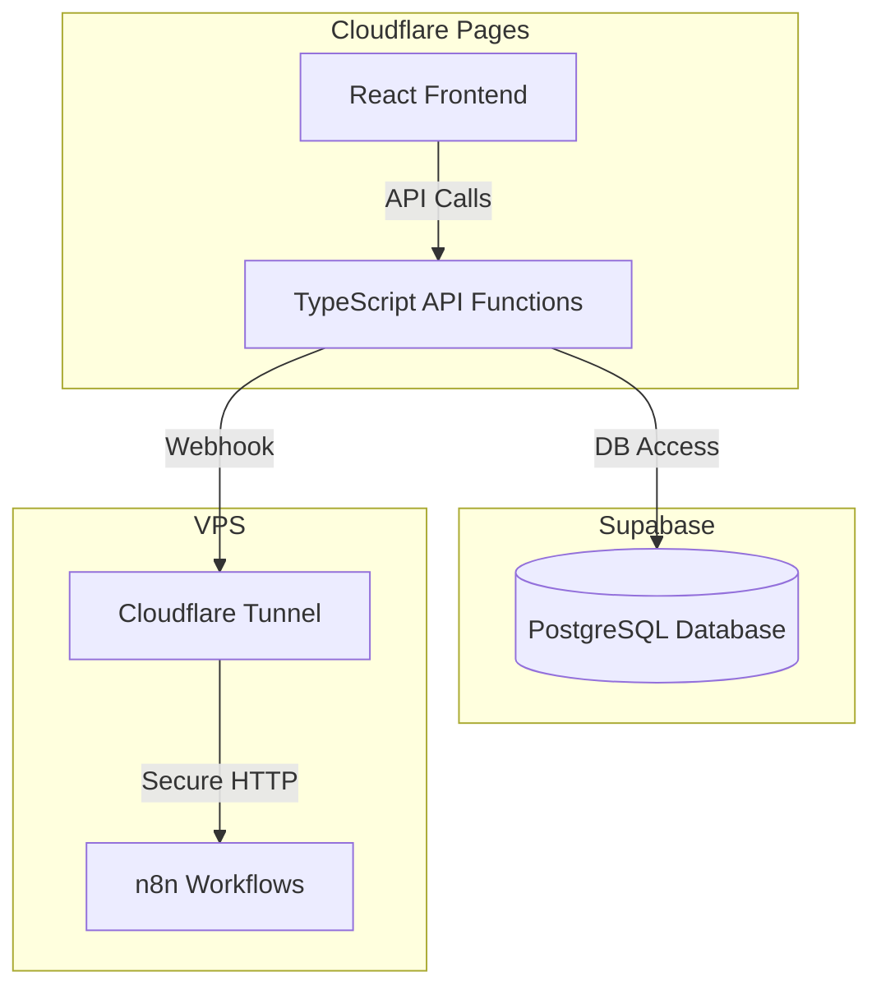

# Deployment Guide

## Overview
This guide explains how to deploy the Customizable Multi-Client Chat Widget Platform, including the monorepo (frontend + backend) on Cloudflare Pages and n8n workflows on a VPS with Cloudflare Tunnel. It covers environment variable setup, secrets management, and CI/CD best practices.

---

## 1. Monorepo Deployment (Frontend + Backend)

### Project Structure
```
/ (repo root)
  /public                # Static assets (optional)
  /src                   # React frontend source code
    /components
    /pages
    ...
  /functions             # API endpoints (backend, serverless functions)
    widgets.ts           # e.g., /api/widgets
    analytics.ts         # e.g., /api/analytics
    webhook.ts           # e.g., /api/webhook
    ...
  package.json
  tsconfig.json
  ...
```

### Steps
1. **Connect your GitHub repo to Cloudflare Pages.**
2. **Configure build settings:**
   - Build command: `pnpm run build` (Vite is used as the build tool for the frontend)
   - Output directory: `dist` or as per your frontend setup
3. **Cloudflare Pages Functions:**
   - Place all backend API endpoints in `/functions`.
   - Each `.ts` file becomes an API route (e.g., `/functions/widgets.ts` → `/api/widgets`).
4. **Environment Variables:**
   - Set in the Cloudflare Pages dashboard under "Settings > Environment Variables".
   - Example:
     - `SUPABASE_URL`
     - `SUPABASE_SERVICE_KEY` or `SUPABASE_ANON_KEY`
     - `N8N_BASE_URL`
     - `ALERT_EMAIL`, `SENDGRID_API_KEY` (if using email alerts)
5. **Push to GitHub:**
   - Cloudflare Pages will automatically build and deploy both frontend and backend.
6. **Access your app:**
   - Frontend: `https://yourproject.pages.dev`
   - API: `https://yourproject.pages.dev/api/widgets`, etc.

---

## 2. n8n Workflow Deployment (VPS + Cloudflare Tunnel)

### Steps
1. **Provision a VPS** (Ubuntu or similar).
2. **Install Docker and Docker Compose.**
3. **Set up n8n with Docker Compose:**
   ```yaml
   version: '3.1'
   services:
     n8n:
       image: n8nio/n8n
       restart: always
       ports:
         - 5678:5678
       environment:
         - N8N_BASIC_AUTH_ACTIVE=true
         - N8N_BASIC_AUTH_USER=youruser
         - N8N_BASIC_AUTH_PASSWORD=yourpass
         # Add other n8n env vars as needed
       volumes:
         - ./n8n_data:/home/node/.n8n
   ```
4. **Start n8n:**
   ```bash
   docker-compose up -d
   ```
5. **Set up Cloudflare Tunnel:**
   - Install `cloudflared` on your VPS.
   - Authenticate with your Cloudflare account.
   - Run:
     ```bash
     cloudflared tunnel create n8n-tunnel
     cloudflared tunnel route dns n8n-tunnel n8n.yourdomain.com
     cloudflared tunnel run n8n-tunnel
     ```
   - This exposes your n8n instance securely at `https://n8n.yourdomain.com`.
6. **Update your backend's `N8N_BASE_URL` to use the tunnel URL.**

---

## 3. Secrets Management
- Store all sensitive keys (Supabase, n8n, email) as environment variables in Cloudflare Pages and on your VPS.
- Never commit secrets to your repository.
- Use `.env.local` for local development, but add `.env*` to `.gitignore`.

---

## 4. CI/CD Best Practices
- Use GitHub Actions or similar for linting, testing, and build checks before deploy.
- Protect main branches with required status checks.
- Use preview deployments for feature branches (Cloudflare Pages supports this out of the box).
- Regularly update dependencies and monitor for vulnerabilities.

---

## 5. Diagrams

### Deployment Overview


---

## 6. Troubleshooting & Tips
- Use Cloudflare Pages logs for build and runtime errors.
- Use Supabase dashboard for DB monitoring.
- Monitor n8n logs via Docker or the n8n UI.
- Test webhooks with Postman or curl before connecting to production widgets.

---

## 7. Demo Widget Deployment & Routing

- **Route:** Demo widgets are served from the same domain as the admin dashboard, under `/demo/:demoId` (e.g., `https://chat.cylostream.com/demo/abc123`).
- **Public Access:** Demo widgets are public and require no authentication for chat.
- **Routing:** Configure your React router and/or Cloudflare Pages Functions to handle `/demo/:demoId` as a public route that loads the demo widget UI.
- **Environment Variables:** No special variables required, but you may want to set a default demo widget expiry (e.g., `DEMO_WIDGET_EXPIRY_HOURS`).
- **Build/CI:** No extra build steps needed; demo widgets are part of the main deployment.
- **Security:** Demo widgets should have limited features and may display a watermark or banner indicating "Demo Mode".

---

## 8. Scheduled Cleanup for Demo Widgets

- **Purpose:** Automatically delete expired demo widgets and all related data (chat logs, analytics, webhook errors) to ensure no demo data lingers after expiry.
- **How:**
  - Implement a Supabase Edge Function that runs on a schedule (e.g., every hour).
  - The function queries for demo widgets where `is_demo = TRUE` and `expires_at < NOW()`, and deletes them.
  - Thanks to `ON DELETE CASCADE`, all related data is also removed.
- **Deployment:**
  - Write the cleanup logic in TypeScript/JavaScript as a Supabase Edge Function.
  - Schedule it using the Supabase dashboard (see [Supabase Scheduled Functions](https://supabase.com/docs/guides/functions/schedule-functions)).
- **Recommended:** This is the best approach for serverless/Supabase projects—no extra infrastructure required.
- **User Experience:** If a client tries to access an expired demo widget, they will see a 'Demo expired' message.

---

## 9. Widget Embedding, Backups, and Admin Controls

- **Embedding:** Widgets can be embedded on client websites via a single script tag or iframe. The admin dashboard provides an easy way to generate and copy the embed code for each widget.
- **Backups & Rollback:** Regular database backups and rollback plans are already in place.
- **Legal & GDPR:** All deployments are GDPR compliant and legal requirements are handled.
- **Manual Cleanup:** Admin dashboard provides manual cleanup controls for widgets and demo widgets.
- The widget bundle is optimized for minimal size and fast loading to ensure accessibility and performance on all client sites.
- Bulk delete and manual cleanup are available in the admin dashboard for widgets, chat logs, and demo widgets.
- If n8n is down or times out, the widget displays a user-friendly error message to the end user. 